# Gitによるソースコードのバージョン管理について
## はじめに
この記事は[「NBUゆるゆるかれんだー Advent Calendar 2021」](https://adventar.org/calendars/6491)用に執筆しました。

突然ですが皆さん、ソースコードのバージョン管理はしていますでしょうか？

バージョン管理とは、[プロジェクトの中で更新されていく様々な成果物の変更の履歴を成果物そのものも含めて記録すること](https://eng-entrance.com/git-vesion-control)だそうです。

簡単に解釈すると、ファイルの変更を記録することで「**いつ何を書き加えたか**」「**いつ何を変更したか**」を知る事ができたり、ファイルを**過去の状態に復元**したり出来るようにするということです。

下図にバージョン管理の例を出します。
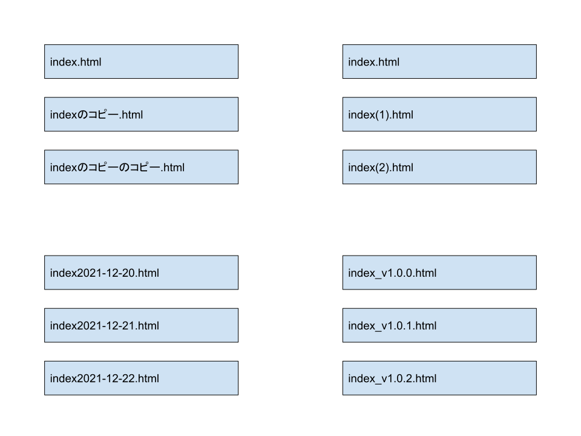
これもバージョン管理の一例です。ファイルに変更がある度にファイルを複製して過去のファイルを残しています。一番簡単なバージョン管理の方法です。

しかし、この方法には問題点がいくつかあります。
* ファイルのどこを変更したかが分からない
* バージョンごとにファイル名を変える必要がある(例えば"indexのコピー.html"というファイル名は本番環境では使えない)

などなど...

そこで、これらの問題を克服するための定番ツールが存在します。  
それが**Git**です。

Gitとは、[プログラムのソースコードなどの変更履歴を記録・追跡するための分散型バージョン管理システム](https://ja.wikipedia.org/wiki/Git)のことです。

要するに、**めっちゃ便利なツール**です(雑)。  
次項からGitの使い方を解説していきます。
## Gitの環境構築
Gitを使うにはまずGitのインストールが必要です。  
Gitのインストールについては以下のサイトが詳しいので参考にしてください。  
Windowsの方・Macの方も**Gitの初期設定**まで進めておいてください。
* [【Windows】Gitの環境構築をしよう！
 | プログラミングの入門なら基礎から学べるProgate[プロゲート]](https://prog-8.com/docs/git-env-win)
* [【Mac】Gitの環境構築をしよう！
 | プログラミングの入門なら基礎から学べるProgate[プロゲート]](https://prog-8.com/docs/git-env)
## 使い方(ハンズオン)
Gitの環境構築はできましたでしょうか。

ここでは実際にコマンドを打ってGitを使ってみましょう。

1. まず、Windowsの方はスタートメニューから**Git Bash**を開きます。Macの方は**ターミナル**を開きます。

1. Windowsの方は`cd 'C:\Users\(ユーザー名)\Documents\'`と入力してEnter。  
Macの方は`cd /Users/(ユーザー名)/Documents/`と入力してEnter(return)。  
今入力したものは、コマンドの実行対象のディレクトリ(フォルダのこと)をWindowsの方はドキュメントに、Macの方は書類に変更するためのものです。ディレクトリはどこにしても大丈夫です。

1. ここからはWindowsの方もMacの方も同じコマンドです。  
`mkdir git-test`と入力してEnter。  
**git-test**という**ディレクトリを作る**コマンドです。

1. `cd git-test`と入力してEnter。
コマンドの**実行対象のディレクトリ**を**git-testに変更**するコマンドです。

1. `touch test.txt`と入力してEnter。  
**test.txt**という**空のテキストファイルを作成**するコマンドです。

1. Windowsの方は**エクスプローラー**から**ドキュメント**の中の**git-test**フォルダを開いてその中の**test.txt**をダブルクリックで開きます。メモ帳が起動します。  
Macの方は**Finder**から**書類**の中の**git-test**フォルダを開いてその中の**test.txt**をダブルクリックで開きます。テキストエディットが開きます。

1. メモ帳またはテキストエディットでtest.txtが開かれるので、**適当に文字を入力**して**保存**します。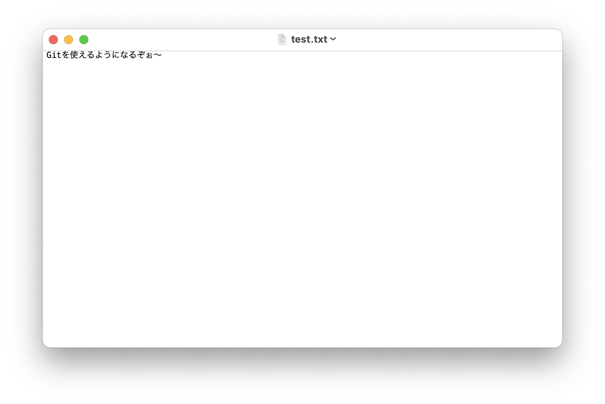

1. Git Bashまたはターミナル戻って`git init`と入力してEnter。  
このコマンドはgit-testディレクトリ配下をgitで管理できるように**初期化**するコマンドです。**最初の1回だけ**実行します。

    ### ここでGitの理論について説明します。分からなかったら後から読み返してください。  

    - まず、Gitで1番良く使うのは**コミット**です。  
    コミットとは、その時点のファイルの**状態を保存**することです。コミットしておけば、後からその時点の状態に戻ったり、その時点で何を変更したのかが分かります。  
    コミットするためのコマンドは`git commit -m "コミットメッセージ"`です。（今は入力しなくても大丈夫です。）  
    **コミットメッセージ**とはコミットにつける名前です。コミットする際は**コミットメッセージが必須**になります。  

    - しかし、コミットする前に必ずしなければならないことがあります。それが**ステージング**です。  
    ステージングとは、**コミットしたいファイルを指定**することです。例えば、「ファイルA」「ファイルB」「ファイルC」があったとします。このとき、"「ファイルA」と「ファイルB」はコミットしたいけど「ファイルC」はコミットしたくない"という場合は`git add ファイルA ファイルB`と入力します。逆に、すべてのファイルをコミットしたい時は`git add .`と入力します。殆どの場合`git add .`しか使わないと思います。  

    - そしてあともう1つのコマンド。今、**何のファイルがステージングされているのか知りたい**ですよね。その時に使うコマンドが`git status`です。  
      - **何もステージングしていない時**は下図のように表示されます。(表示形式はターミナルやGitBashの環境設定によって異なります。)
      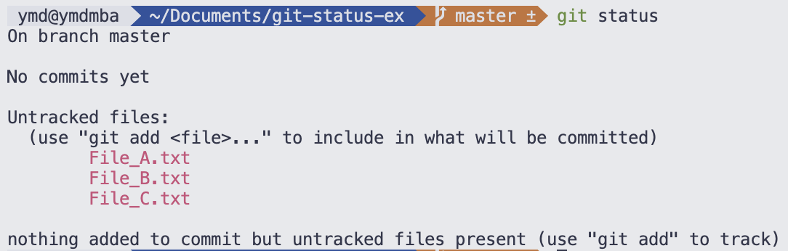  
        
      - **File_A.txt**と**File_B.txt**をステージングしているとき。
      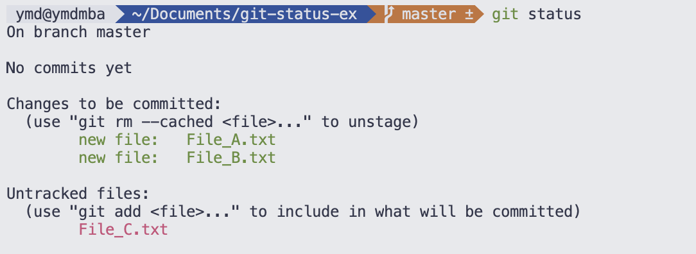  

      - **すべてのファイル**をステージングした時。
      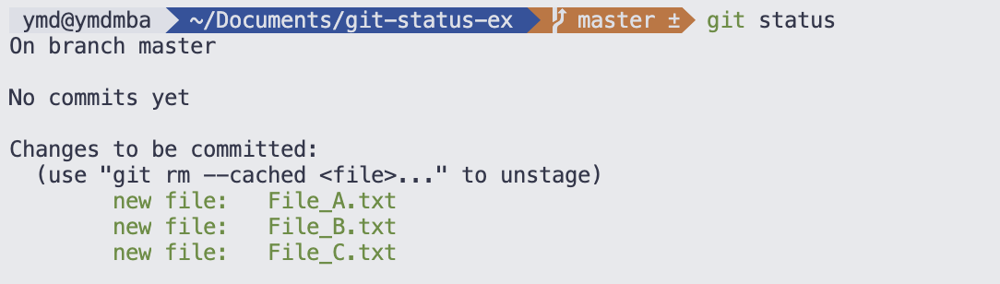  

      - **コミット直後**。
      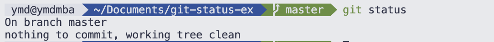  
      コミット直後に`git status`と打ってもファイルが何も表示されません。ファイルの内容に変更があれば再度表示されます。  

    - ここまで説明してきたGitの理論についてフローチャートでまとめるとこうなります。
    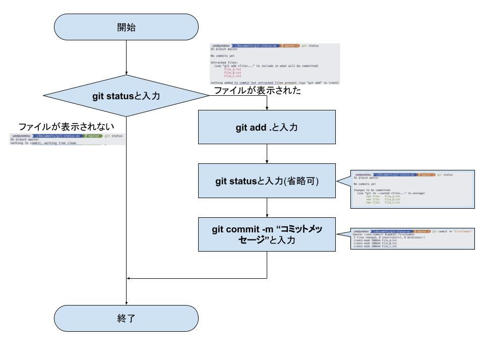
    理論はここまでにしてハンズオンに戻りましょう。

1. 先程に続いてGit Bashまたはターミナルで`git status`と入力してEnter。するとファイルが表示されます。

1. `git add .`と入力してEnter。ファイルを**ステージング**します。

1. `git status`と入力してEnter。ステージングされた旨が表示されます。

1. `git commit -m "init"`と入力してEnter。コミットの名前を"init"として**コミット**します。

1. `git status`と入力してEnter。ファイルが表示されなければコミットできています！  
ここまでお疲れさまでした。これで最初のコミットができました。続いてファイルの内容を変更し、複数回コミットしていきましょう。

1. test.txtをメモ帳またはテキストエディットで開きます。

1. 適当に文字を**書き加え**ます。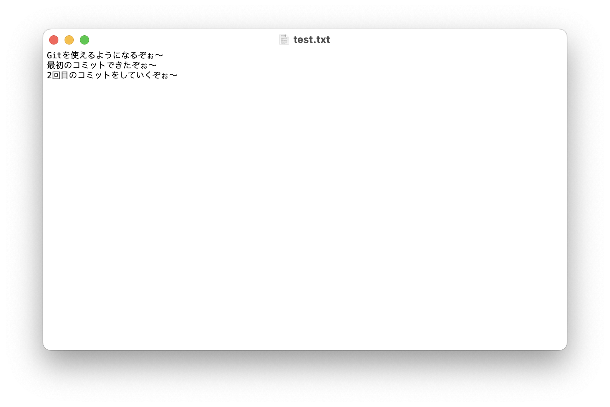

1. Git Bashまたはターミナルに戻って`git status`と入力してEnter。ファイルが表示されます。

1. `git add .`と入力してEnter。ファイルを**ステージング**します。

1. `git status`と入力してEnter。ステージングされた旨が表示されます。

1. `git commit -m "Add text"`と入力してEnter。

1. `git status`と入力してEnter。ファイルが表示されなければ2回目の**コミット**ができています！続いて3回目のコミットもしてみましょう。

1. test.txtをメモ帳またはテキストエディットで開きます。

1. 適当に文字**書き換え**ます。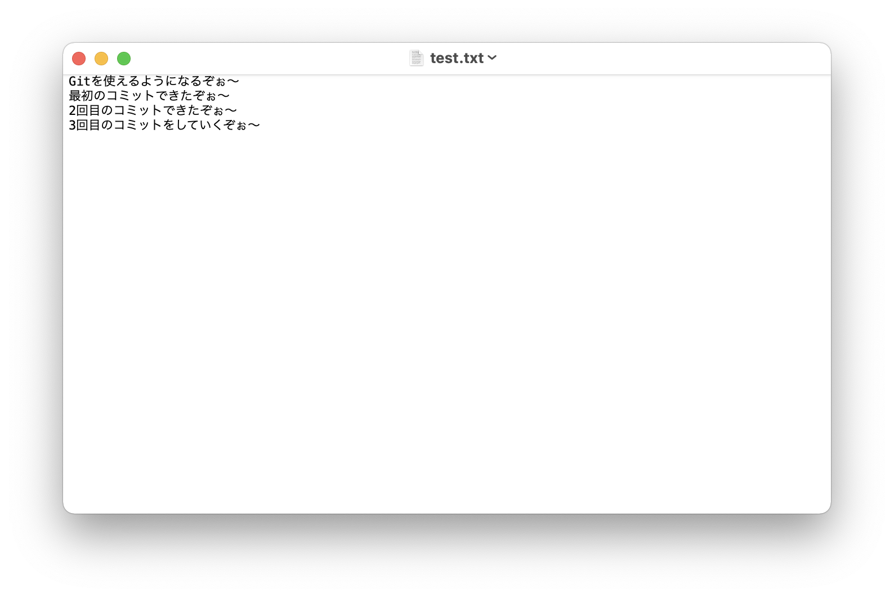

1. Git Bashまたはターミナルに戻って`git status`と入力してEnter。ファイルが表示されます。

1. `git add .`と入力してEnter。ファイルを**ステージング**します。

1. `git status`と入力してEnter。ステージングされた旨が表示されます。

1. `git commit -m "Update text"`と入力してEnter。

1. `git status`と入力してEnter。ファイルが表示されなければ3回目の**コミット**ができています！

1. ここまでコミットを3回してきましたが、コミットの**履歴を一覧で確認**したいですよね。それでは一覧で確認するコマンドを入力してみましょう。  
`git log`と入力してEnter。するとコミット履歴が一覧で表示されます。**上下矢印キーでスクロール**できます。表示を**終了するには`q`キー**を押します。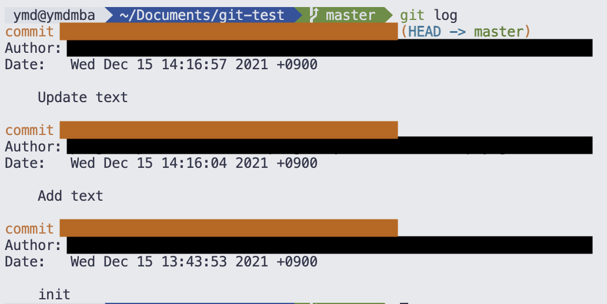  
ここまででコミットのやり方を説明してきました。続いてファイルの状態を**過去のコミットに戻す**方法を説明していきます。

1. ファイルの状態をinitに戻してみましょう。  
まず`git log`と入力してEnter。
そして、initの上の**commitの右にある長い文字列**(ハッシュ値)をコピーします。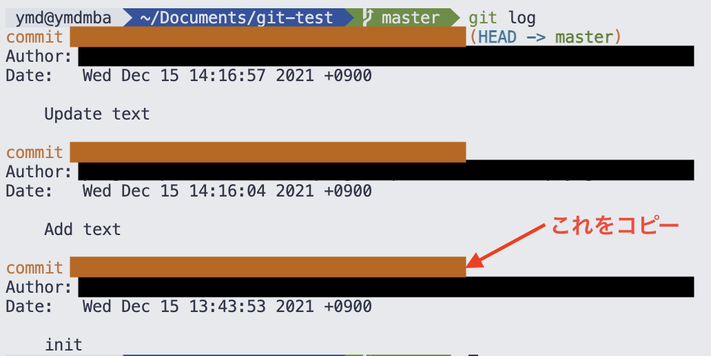

1. `git checkout コピーしたハッシュ値をペースト`と入力してEnter。これでファイルの状態がinitのときに戻ります。

1. test.txtをメモ帳やテキストエディットで開いて確認してみましょう。

戻っています。このように**戻りたいコミットのハッシュ値をコピペ**して**checkoutコマンド**を打てばそのコミットに戻ることができます。

1. 続いてもう一度**最新の状態に戻る**方法です。`git checkout master`と入力してEnter。最新の状態(Update text)に戻ります。

## まとめ

今回は**コミット**の方法と**特定のコミットに一時的に戻る**方法を説明してきました。これで**最低限**はGitが使えるようになったと思います。今回説明したことは**Gitの核**となる部分ですが、この他にもたくさんの機能があります。(ブランチ、マージ、etc...)  
また、**GitHub**を使うと更に便利なことができます。(プッシュ、プル、フェッチ、プルリクエスト、etc...)  
私もまだすべての機能が使いこなせておらず、勉強中です。
インターネット上には分かりやすい記事が沢山あるので、一緒に勉強していきましょう！

[この記事のリポジトリ](https://github.com/penguinspizza/git-article)

&copy; 2021 penguinspizza(ぶたのけいとん)